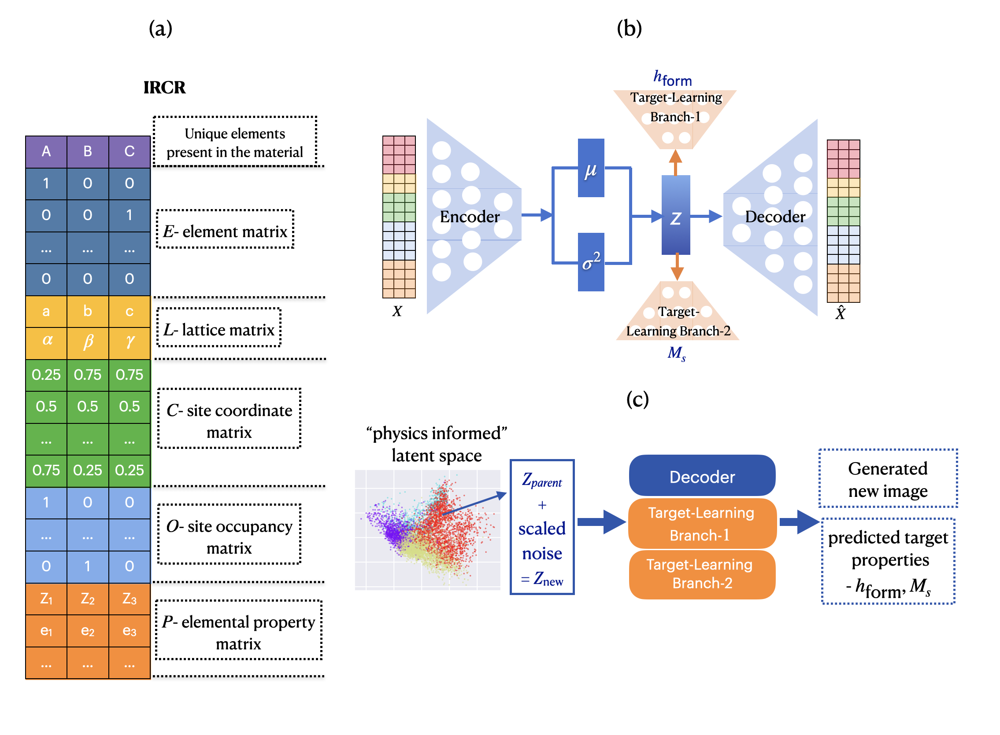
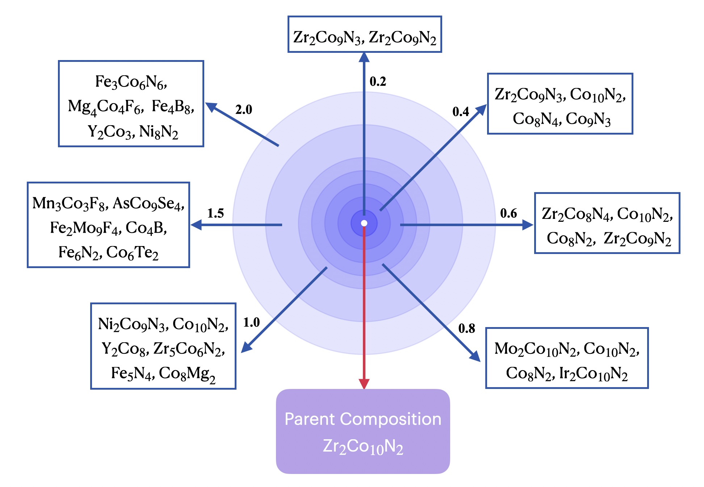

# MagGen
MagGen: A Graph-Aided Deep Generative Model for Inverse Design of Permanent Magnets


DiffCrysGen is a score-based diffusion model. It treats the entire materials representation with a single, unified diffusion process, allowing a single denosing neural network to predict a holistic score for the entire noisy crystal data. This unified treatment significantly simplifies the architecture and improves the computational efficiency.


## Generative diffusion framework in DiffCrysGen


---

## Architecture of the denoising neural network


---


## License

This project is licensed under the **MIT License**.

See the [LICENSE](LICENSE) file for details.

Developed by: [Sourav Mal](https://github.com/SouravMal) at Harish-Chandra Research Institute (HRI) (https://www.hri.res.in/), Prayagraj, India.


## Citation

Please consider citing our work if you find it helpful:

```bibtex
@Article{Mal2024,
author={Mal, Sourav
and Seal, Gaurav
and Sen, Prasenjit},
title={MagGen: A Graph-Aided Deep Generative Model for Inverse Design of Permanent Magnets},
journal={The Journal of Physical Chemistry Letters},
year={2024},
month={Mar},
day={28},
publisher={American Chemical Society},
volume={15},
number={12},
pages={3221-3228},
doi={10.1021/acs.jpclett.4c00068},
url={https://doi.org/10.1021/acs.jpclett.4c00068}
}
```


## Contact

If you have any questions, feel free to reach us at:
**Sourav Mal** <souravmal492@gmail.com> 
